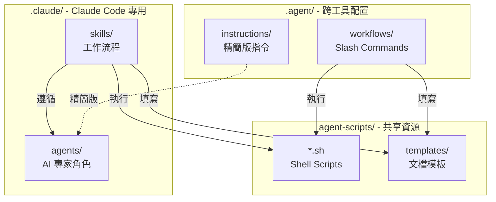

# .agent Directory

本目錄為 **跨 AI Agent 通用的配置與工作流程系統**，支援 Antigravity (Gemini)、Claude Code、Cursor 等 AI 工具。

---

## 📁 目錄結構

```
.agent/
├── README.md           # 本文件 (系統總覽)
├── instructions/       # AI 行為準則與專業指令
├── workflows/          # 可執行的工作流程 (Slash Commands)
├── scripts/            # 輔助腳本 (少量，主要在 agent-scripts/)
└── templates/          # 文檔模板片段 (主要在 agent-scripts/templates/)
```

---

## 🏗️ 三層架構關係

本專案採用**三層配置架構**，各司其職：

```
┌─────────────────────────────────────────────────────────────┐
│ .agent/                                                     │
│ 📋 跨 AI 工具通用配置                                         │
│ - Antigravity (Gemini) 原生支援                              │
│ - 精簡版 Instructions                                        │
│ - Slash Command Workflows                                   │
└─────────────────────────────────────────────────────────────┘
                            ↓ 呼叫
┌─────────────────────────────────────────────────────────────┐
│ agent-scripts/                                              │
│ 🛠️ 共享自動化腳本與模板                                        │
│ - Shell Scripts (*.sh)                                      │
│ - 文檔模板 (templates/*.md)                                  │
│ - 所有 AI 工具與系統共用                                       │
└─────────────────────────────────────────────────────────────┘
                            ↑ 參照
┌─────────────────────────────────────────────────────────────┐
│ .claude/                                                    │
│ 🤖 Claude Code 專用系統                                       │
│ - AI Agents (隱式觸發的專家角色)                               │
│ - Skills (顯式呼叫的工作流程)                                  │
│ - 詳細版檢查清單與範例                                         │
└─────────────────────────────────────────────────────────────┘
```

### 三層分工

| 層級 | 用途 | 適用工具 | 特點 |
|------|------|----------|------|
| **`.agent/`** | 跨工具通用配置 | Antigravity, Cursor, Claude Code | 精簡、slash commands |
| **`agent-scripts/`** | 共享執行資源 | 所有工具 | 實際執行的腳本與模板 |
| **`.claude/`** | Claude Code 專用 | Claude Code | 自動觸發、詳細檢查清單 |

---

## 🔗 互動關係圖



---

## 📂 .agent/ 核心內容

### 📚 Instructions (指令檔案)

位置：`.agent/instructions/`

| 檔案 | 用途 | Claude Code 對應 |
|------|------|------------------|
| `laravel-expert.md` | Laravel 開發規範 | `.claude/agents/laravel-expert.md` |
| `flutter-expert.md` | Flutter 開發規範 | `.claude/agents/flutter-expert.md` |
| `git-commit-tw.md` | Git Commit 繁中規範 | `.claude/agents/` (整合在各 agent) |
| `security-review-laravel.md` | Laravel 安全審查 | `.claude/skills/laravel-security-review/` |
| `security-review-flutter.md` | Flutter 安全審查 | `.claude/skills/flutter-security-review/` |
| `performance-review.md` | 效能優化指南 | `.claude/skills/*-performance-review/` |

**特點**：
- ✅ 精簡版，token 消耗低
- ✅ 適合日常開發引用
- ✅ Antigravity 自動載入

---

### ⚡ Workflows (工作流程)

位置：`.agent/workflows/`

| Slash Command | 功能 | 呼叫腳本 |
|--------------|------|----------|
| `/建立session` | 建立開發 Session | `agent-scripts/create-session.sh` |
| `/封存session` | 封存 Session | `agent-scripts/archive-session.sh` |
| `/更新changelog` | 更新 Changelog | `agent-scripts/update-changelog.sh` |
| `/init-docs` | 初始化文檔結構 | `agent-scripts/init-docs.sh` |
| `/更新openapi_yaml` | 更新 OpenAPI 規格 | (workflow 內建邏輯) |

**執行方式**：
- **Antigravity (Gemini)**: 直接輸入 slash command（例如 `/建立session`）
- **Claude Code**: 使用對應的 Skill（例如 `/create-session`）
- **其他 AI**: 手動執行對應的 script（例如 `./agent-scripts/create-session.sh`）

---

## 🛠️ agent-scripts/ 共享資源

位置：`../agent-scripts/`

此目錄包含**所有 AI 工具共用的自動化腳本與文檔模板**。

### 可用腳本

| 腳本 | 功能 | 被呼叫自 |
|------|------|----------|
| `create-session.sh` | 建立開發 Session | `.agent/workflows/`, `.claude/skills/` |
| `archive-session.sh` | 封存 Session | `.agent/workflows/`, `.claude/skills/` |
| `create-branch.sh` | 建立 Git Branch | 手動執行 |
| `update-changelog.sh` | 更新 Changelog | `.agent/workflows/` |
| `init-docs.sh` | 初始化文檔結構 | `.agent/workflows/` |
| `verify-refactoring.sh` | 驗證重構完整性 | 手動執行 |
| `sync-config-repos.sh` | 同步配置 repos | 手動執行 |

### 可用模板

| 模板 | 用途 | 使用者 |
|------|------|--------|
| `session.md` | Session 文檔模板 | `create-session.sh` |
| `GUIDE.md` | Session 使用指南 | `init-docs.sh` |
| `INDEX-*.md` | 索引文檔模板 | `init-docs.sh` |
| `GEMINI.md` | 專案 AI 配置模板 | `init-docs.sh` |

**詳細說明**：請參考 [agent-scripts/README.md](../agent-scripts/README.md)

---

## 🎯 使用場景對照

### Scenario 1: 建立新的開發 Session

| 工具 | 操作方式 | 實際執行 |
|------|----------|----------|
| **Antigravity** | `/建立session` | `.agent/workflows/建立session.md` → `agent-scripts/create-session.sh` |
| **Claude Code** | `/create-session` | `.claude/skills/create-session/SKILL.md` → `agent-scripts/create-session.sh` |
| **Cursor/其他** | `./agent-scripts/create-session.sh` | 直接執行腳本 |

### Scenario 2: Laravel 安全審查

| 工具 | 操作方式 | 使用的指令/資源 |
|------|----------|-----------------|
| **Antigravity** | 引用 `@.agent/instructions/security-review-laravel.md` | 精簡版檢查清單 |
| **Claude Code** | `/laravel-security-review` | `.claude/skills/laravel-security-review/` (詳細版) |
| **Cursor/其他** | 手動引用 `.agent/instructions/security-review-laravel.md` | 精簡版檢查清單 |

### Scenario 3: Git Commit 整理

| 工具 | 操作方式 | 實際執行 |
|------|----------|----------|
| **Antigravity** | 引用 `@.agent/instructions/git-commit-tw.md` | 手動遵循規範 |
| **Claude Code** | `/git-organize-commits` | `.claude/skills/git-organize-commits/` (自動整理) |
| **Cursor/其他** | 引用 `.agent/instructions/git-commit-tw.md` | 手動遵循規範 |

---

## 🤖 不同 AI 工具使用指南

### Antigravity (Gemini) ✅ 原生支援

**自動載入**：
- `instructions/` 中的檔案會自動作為系統指令
- `workflows/` 可透過 slash commands 執行

**使用方式**：
```
# 引用指令
@[.agent/instructions/flutter-expert.md]

# 執行工作流程
/建立session
/封存session
/更新changelog
```

---

### Cursor ✅ 完整支援（需配置）

**設定方式**：
1. 在專案根目錄創建 `.cursorrules` 檔案（已自動建立）
2. Cursor 會在每次對話時自動載入 `.cursorrules` 中的指令

**使用方式**：

**引用 Instructions**：
```
請參考 .agent/instructions/flutter-expert.md 中的規範
```

**執行腳本**：
```bash
# 在 Cursor 終端機中執行
./agent-scripts/create-session.sh
./agent-scripts/archive-session.sh
```

---

### GitHub Copilot ⚠️ 有限支援

**使用方式**：
- 無法直接讀取 `.agent/` 結構
- 可透過註解引導：

```dart
// 請參考 .agent/instructions/flutter-expert.md 中的規範
// 使用 BLoC pattern 實作狀態管理
```

**建議**：
- 在程式碼中加入註解引用相關指令
- 手動執行 `agent-scripts/` 中的腳本

---

### ChatGPT / GPT-5 (網頁版) ❌ 不支援

**替代方案**：
1. 手動複製 `.agent/instructions/` 中的內容到對話中
2. 在對話開始時貼上相關指令：

```
請遵循以下 Flutter 開發規範：
[貼上 flutter-expert.md 的內容]
```

---

## 💡 最佳實踐

### 1. 選擇適合的層級

- **日常開發**: 使用 `.agent/instructions/`（token 消耗較低）
- **深度審查**: 使用 `.claude/skills/`（詳細檢查清單）
- **腳本執行**: 直接呼叫 `agent-scripts/*.sh`

### 2. 專案初始化

```bash
# 執行文檔初始化
./agent-scripts/init-docs.sh .

# 或使用 workflow (Antigravity)
/init-docs
```

### 3. 開發新功能

```bash
# 方式 1: 快速建立（推薦）
./agent-scripts/create-session.sh 實作商品搜尋功能

# 方式 2: 使用 workflow (Antigravity)
/建立session

# 方式 3: 使用 skill (Claude Code)
/create-session

# 完成後封存
./agent-scripts/archive-session.sh
# 或
/封存session  # Antigravity
```

### 4. 發布新版本

```bash
# 更新 Changelog
./agent-scripts/update-changelog.sh
# 或
/更新changelog  # Antigravity
```

---

## 🔄 跨專案共用

本 `.agent/` 目錄可被多個子專案共用：

```
q03/                     # Workspace 根目錄
├── .agent/              # 跨工具通用配置
├── .claude/             # Claude Code 專用配置
├── agent-scripts/       # 共享腳本與模板
│
├── backend/             # Laravel 專案
│   ├── CLAUDE.md        # 引用 ../.agent/
│   └── GEMINI.md        # 引用 ../.agent/
│
└── frontend/            # Flutter 專案
    ├── CLAUDE.md        # 引用 ../.agent/
    └── GEMINI.md        # 引用 ../.agent/
```

**在子專案中使用**：
```markdown
# backend/GEMINI.md
## 🤖 AI Agent Configuration

### 📚 Instructions
- **Laravel 開發**: @[../.agent/instructions/laravel-expert.md]
- **Git Commits**: @[../.agent/instructions/git-commit-tw.md]
```

---

## 📝 維護指南

### 新增 Instruction

1. 在 `.agent/instructions/` 中創建新的 `.md` 檔案（精簡版）
2. 在 `.claude/agents/` 中創建對應的詳細版（如適用）
3. 在專案 `GEMINI.md` / `CLAUDE.md` 中加入引用

### 新增 Workflow

1. 在 `.agent/workflows/` 中創建新的 `.md` 檔案
2. 在 `agent-scripts/` 中創建對應的 `.sh` 腳本
3. 在 `.claude/skills/` 中創建對應的 Skill（如適用）

### 新增 Skill (Claude Code 專用)

1. 在 `.claude/skills/` 中創建新目錄
2. 撰寫 `SKILL.md` 與資源文件
3. 在 Skill 中參照 `agent-scripts/*.sh` 執行操作

---

## ❓ 常見問題

**Q: `.agent/` 和 `.claude/` 有什麼不同？**
A: `.agent/` 是跨工具通用配置（精簡版），`.claude/` 是 Claude Code 專用（詳細版，自動觸發）。

**Q: `agent-scripts/` 的角色是什麼？**
A: 共享的執行資源層，所有 AI 工具與配置系統都會呼叫這裡的腳本與模板。

**Q: 我應該用哪個？**
A:
- Antigravity 用戶 → 使用 `.agent/`
- Claude Code 用戶 → 使用 `.claude/skills/`（`.agent/` 作為快速參考）
- Cursor 用戶 → 引用 `.agent/instructions/`，執行 `agent-scripts/*.sh`

**Q: 需要加入版本控制嗎？**
A: 建議加入！這樣團隊成員都能使用相同的 AI 配置。

---

## 📚 相關資源

- **Claude Code 系統**: [../.claude/README.md](../.claude/README.md)
- **共享腳本與模板**: [../agent-scripts/README.md](../agent-scripts/README.md)
- **專案指引**: [../CLAUDE.md](../CLAUDE.md)
- **使用範例**: [USAGE_EXAMPLE.md](USAGE_EXAMPLE.md)

---

**Last Updated**: 2026-01-23
