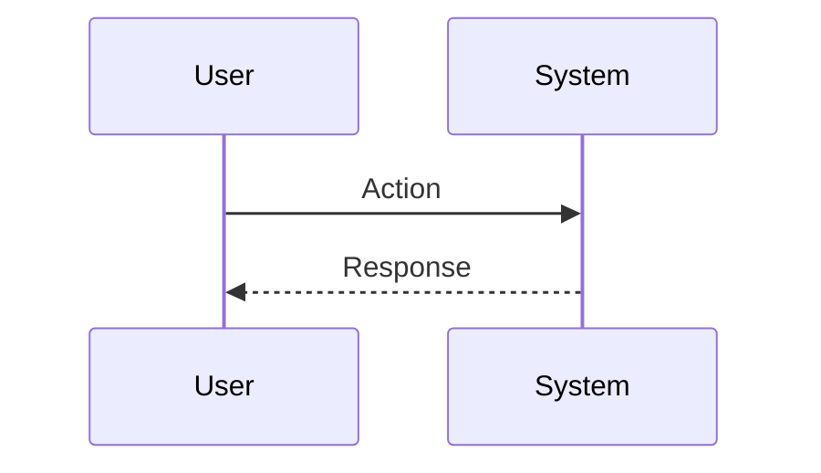

# Session: [Feature Name]

**Date**: YYYY-MM-DD
**Status**: 🔄 In Progress
**Duration**: [預估/實際] 小時
**Issue**: #XX
**Contributors**: @username, Claude AI
**Branch**: [new-branch-name]
**Tags**: <!-- 詳見 GUIDE.md -->
<!-- #decisions, #architecture, #api, #product, #infrastructure, #refactor -->

**Categories**: <!-- 例如：State Management, API Integration -->

---

## 📋 Overview

### Goal
[一句話說明：我們想要達成什麼目標？]

### Related Documents
- **PRD**: [連結到 docs/product/PRD.md 或 features/]
- **Feature Spec**: [如果有，請提供連結]
- **Related Sessions**: [相關 Session 連結]

### Commits
- `commit message` (hash) - [開發過程中填寫]

---

## 🎯 Context

### Problem
[我們要解決什麼問題？這對應到什麼痛點？]

### User Story
> As a [使用者類型], I want to [動作] so that [效益].

### User Flow


### Current State
[目前的系統是如何運作的？現有哪些功能？缺少什麼？]

**Gap**: [缺失了什麼部分是我們需要新增的？]

---

## 💡 Planning

### Approach Analysis

#### Option A: [Name] [✅ CHOSEN | ❌ REJECTED]
[簡短描述或程式碼草圖]

**Pros**:
- [優點 1]
- [優點 2]

**Cons**:
- [缺點 1]
- [缺點 2]

#### Option B: [Name] [✅ CHOSEN | ❌ REJECTED]
[簡短描述]

**Pros**:
- [優點 1]

**Cons**:
- [缺點 1]

**Decision Rationale**: [選擇這個方案的理由]

### Design Decisions

#### D1: [Decision Title]
- **Options**: A, B, C
- **Chosen**: B
- **Reason**: [原因]
- **Trade-offs**: [權衡犧牲了什麼]

---

## ✅ Implementation Checklist

### Phase 1: [Phase Name] [✅ Completed | 🔄 In Progress | ⏳ Pending]
- [ ] 任務 1
- [ ] 任務 2
- [ ] 任務 3

### Phase 2: [Phase Name] [✅ | 🔄 | ⏳]
- [ ] 任務 4
- [ ] 任務 5

### Phase 3: Testing [✅ | 🔄 | ⏳]
- [ ] Unit tests (單元測試)
- [ ] Widget tests (Widget 測試)
- [ ] Integration tests (整合測試)
- [ ] Manual testing (手動測試)

---

## 🚧 Blockers & Solutions

### Blocker 1: [Title] [✅ RESOLVED | 🔄 IN PROGRESS | ⏸️ BLOCKED]
- **Issue**: [阻礙進度的原因]
- **Impact**: [造成的影響]
- **Solution**: [如何解決]
- **Resolved**: [解決時間]

---

## 📊 Outcome

### What Was Built
[交付成果清單 - 完成後填寫]

### Files Created/Modified
```
lib/
├── path/to/file.dart (new|modified)
test/
├── test_file.dart (new)
```

### Metrics
- **Code Coverage**: XX%
- **Lines Added**: ~XXX
- **Lines Modified**: ~XXX
- **Test Files**: X 新增, Y 修改

---

## 🎓 Lessons Learned

### 1. [Lesson Title]
**Learning**: [我們學到了什麼？]

**Solution/Pattern**: [我們如何處理它]

**Future Application**: [如何應用於未來的工作]

---

## ✅ Completion

**Status**: 🔄 In Progress → ✅ Completed
**Completed Date**: YYYY-MM-DD
**Session Duration**: X hours

> ℹ️ **Next Steps**: 詳見 [Session Guide](GUIDE.md)
> 1. 更新上方狀態與日期
> 2. 根據 Tags 更新 INDEX 檔案
> 3. 運行 `./scripts/archive-session.sh`

---

## 🔮 Future Improvements

### Not Implemented (Intentional)
- ⏳ [決定暫不實作的部分與原因]

### Potential Enhancements
- 📌 [未來迭代的想法]

### Technical Debt
- 🔧 [目前暫時接受的已知問題]

---

## 🔗 References

### Related Work
- [類似實作的連結]

### External Resources
- [使用的文章、文件、套件]

### Team Discussions
- [Slack/Discord 討論連結]
