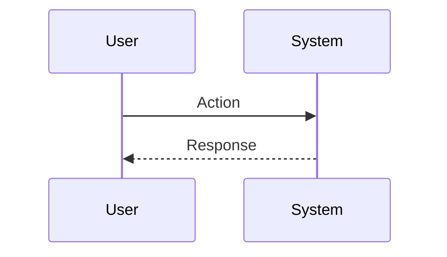

# Session: [Feature Name]

**Date**: YYYY-MM-DD
**Status**: 🔄 In Progress
**Duration**: [Estimated/Actual] hours
**Issue**: #XX
**Contributors**: @username, Claude AI

**Tags**: <!-- 詳見 GUIDE.md -->
<!-- #decisions, #architecture, #api, #product, #infrastructure, #refactor -->

**Categories**: <!-- 例如：State Management, API Integration -->

---

## 📋 Overview

### Goal
[One sentence: What are we trying to achieve?]

### Related Documents
- **PRD**: [Link to docs/product/PRD.md or features/]
- **Feature Spec**: [Link if exists]
- **Related Sessions**: [Links to related sessions]

### Commits
- `commit message` (hash) - [Will be filled during development]

---

## 🎯 Context

### Problem
[What problem are we solving? What pain point does this address?]

### User Story
> As a [user type], I want to [action] so that [benefit].

### User Flow


### Current State
[How does the system work today? What exists? What doesn't?]

**Gap**: [What's missing that we need to add?]

---

## 💡 Planning

### Approach Analysis

#### Option A: [Name] [✅ CHOSEN | ❌ REJECTED]
[Brief description or code sketch]

**Pros**:
- [Advantage 1]
- [Advantage 2]

**Cons**:
- [Disadvantage 1]
- [Disadvantage 2]

#### Option B: [Name] [✅ CHOSEN | ❌ REJECTED]
[Brief description]

**Pros**:
- [Advantage 1]

**Cons**:
- [Disadvantage 1]

**Decision Rationale**: [Why we chose what we chose]

### Design Decisions

#### D1: [Decision Title]
- **Options**: A, B, C
- **Chosen**: B
- **Reason**: [Why]
- **Trade-offs**: [What we gave up]

---

## ✅ Implementation Checklist

### Phase 1: [Phase Name] [✅ Completed | 🔄 In Progress | ⏳ Pending]
- [ ] Task 1
- [ ] Task 2
- [ ] Task 3

### Phase 2: [Phase Name] [✅ | 🔄 | ⏳]
- [ ] Task 4
- [ ] Task 5

### Phase 3: Testing [✅ | 🔄 | ⏳]
- [ ] Unit tests
- [ ] Widget tests
- [ ] Integration tests
- [ ] Manual testing

---

## 🚧 Blockers & Solutions

### Blocker 1: [Title] [✅ RESOLVED | 🔄 IN PROGRESS | ⏸️ BLOCKED]
- **Issue**: [What's blocking progress]
- **Impact**: [How it affects the work]
- **Solution**: [How it was/will be resolved]
- **Resolved**: [Date/Time if resolved]

---

## 📊 Outcome

### What Was Built
[List of deliverables - fill after completion]

### Files Created/Modified
```
lib/
├── path/to/file.dart (new|modified)
test/
├── test_file.dart (new)
```

### Metrics
- **Code Coverage**: XX%
- **Lines Added**: ~XXX
- **Lines Modified**: ~XXX
- **Test Files**: X new, Y modified

---

## 🎓 Lessons Learned

### 1. [Lesson Title]
**Learning**: [What did we discover?]

**Solution/Pattern**: [How we addressed it]

**Future Application**: [How this applies to future work]

---

## ✅ Completion

**Status**: 🔄 In Progress → ✅ Completed
**Completed Date**: YYYY-MM-DD
**Session Duration**: X hours

> ℹ️ **Next Steps**: 詳見 [Session Guide](GUIDE.md)
> 1. 更新上方狀態與日期
> 2. 根據 Tags 更新 INDEX 檔案
> 3. 運行 `./scripts/archive-session.sh`

---

## 🔮 Future Improvements

### Not Implemented (Intentional)
- ⏳ [What we decided not to do yet and why]

### Potential Enhancements
- 📌 [Ideas for future iteration]

### Technical Debt
- 🔧 [Known issues we're accepting for now]

---

## 🔗 References

### Related Work
- [Link to similar implementations]

### External Resources
- [Articles, documentation, packages used]

### Team Discussions
- [Links to Slack/Discord conversations]
